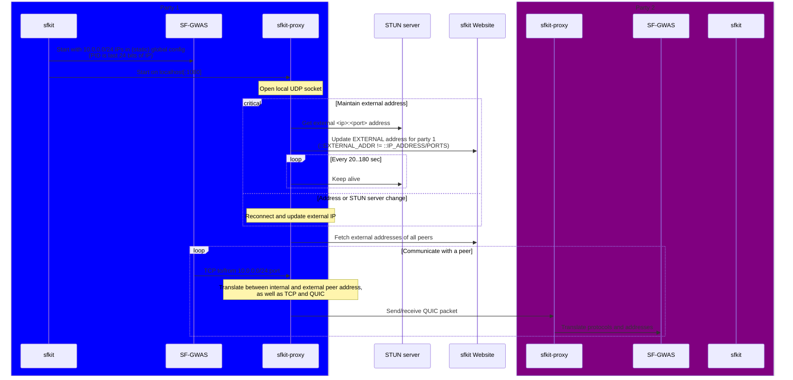

# sfkit-proxy

[sfkit](https://sfkit.org) facilitates secure multi-party computation protocols
via its [CLI](https://github.com/hcholab/sfkit) and [Website](https://github.com/hcholab/sfkit-website),
configured with public IPs and ports of each party.

However, in practice many parties are located behind [NAT](https://en.wikipedia.org/wiki/Network_address_translation)s,
making direct connections problematic without resorting to port forwarding.
This may be hard to orchestrate in private multi-cloud environments like [Terra](https://terra.bio),
or even impossible in some corporate settings (hospitals, research facilities etc.).

Additionally, they usually provide heavily-restricted computing environments
(e.g. an unprivileged Docker container or host), which prohibit any use of
administrative permissions or specialized networking setups.

Here, we propose a solution to this problem in the form of a lightweight local
[SOCKS5](https://en.wikipedia.org/wiki/SOCKS#SOCKS5) proxy,
which enables direct peer-to-peer connections via
[NAT traversal](https://tailscale.com/blog/how-nat-traversal-works/),
facilitated by STUN ([RFC 8489](https://datatracker.ietf.org/doc/html/rfc8489)) discovery protocol and
[QUIC](https://en.wikipedia.org/wiki/QUIC) transmission protocol (RFCs 8999-9002),
which are multiplexed on a [UDP](https://en.wikipedia.org/wiki/User_Datagram_Protocol) socket.

This approach offers substantial flexibility and performance benefits, owing to its use
of standardized, modern and lightweight protocols, which are decoupled
from particular providers and other parts of the networking stack.

## Architecture

In order to avoid changes to [SF-GWAS](https://github.com/hcholab/sfgwas)
MPC protocol implementation and to keep it decoupled from **sfkit**,
we proxy its regular TCP connections to a fixed pool of virtual private `10.0.0.0/24`
peer addresses over a local SOCKS5 proxy, which:
- Opens a long-running local UDP socket
- Connects to a public STUN server from this socket to determine the external NAT IP and port mapping
- Records this external address via **sfkit** website API
- Keeps STUN connection alive for as long as possible
- Re-establishes connection and updates external address in case of network/server changes
- Fetches external addresses of other peers via website API
  
Further, upon a request to send/receive a TCP packet to/from a `10.0.0.0/24` address, this proxy:
- Sends/receives TCP data destined to/sourced from an external peer address via a QUIC packet, which is:
  * multiplexed with STUN on the same UDP socket
  * multiplexed from/to private peer TCP port(s) via a *single* UDP port on the socket
- Fetches updated external peer address in case the peer
  [QUIC connection is closed](https://github.com/quic-go/quic-go#when-the-remote-peer-closes-the-connection)

Effectively, this architecture achieves lightweight VPN-like communication between peers,
very similarly to how it is done in commercial software-defined networks like [Tailscale](https://tailscale.com)
and [ZeroTier](https://www.zerotier.com), but without the need for kernel-mode operation,
proprietary protocols, or unnecessary quotas and limits.

## Implementation

`sfkit-proxy` will be written in Go, with the majority of STUN logic borrowed from
[syncthing](https://github.com/syncthing/syncthing/blob/eed12f3ec51b0e261e5a58033f35161e6d72b496/lib/stun/stun.go),
and QUIC connection logic multiplexed over the UDP socket via [quic-go](https://github.com/quic-go/quic-go/issues/3929)
(see [draft implementation](https://github.com/quic-go/quic-go/pull/3992)).

In the future, it will likely be possible to move some of the connection maintenance logic into the proposed
[QUIC Connection Migration API](https://github.com/quic-go/quic-go/issues/3990).

Also note that a STUN server *does not* proxy actual MPC protocol data, it is only used to determine external NAT mappings;
and it may not be necessary if we can use IPv6 addresses (to be supported in the future).

This allows us to traverse most NATs with the help of public third-party STUN servers
(or one that we maintain, if required by compliance), and *without* the need for a heavyweight relay server.
However, future expansion to support TURN ([RFC 8656](https://datatracker.ietf.org/doc/html/rfc8656)) relay extension to STUN
is relatively straighforward. This will cover network environments with stricter NATs.

Additionally, the current implementation doesn't use authentication for external QUIC communication.
However, this is mitigated by external firewalls (which prevent unsolicited communication)
and unpredictability of dynamic port mappings.
Further, it is fairly straighforward to add mTLS auth, which is
[supported by go-quic](https://github.com/quic-go/quic-go/issues/1366#issuecomment-1036277034),
and will be enabled later on.

Finally, even if STUN/QUIC proxying proves to be unreliable, it is possible
to easily swap them with a commercial-grade SOCKS proxy,
like [Tailscale in userspace mode](https://tailscale.com/kb/1112/userspace-networking/),
which has already been shown to work in early tests.
This should minimize technical risk of this project.
